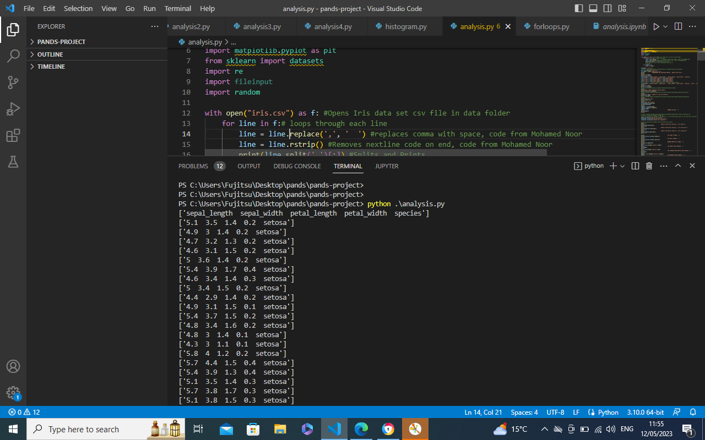
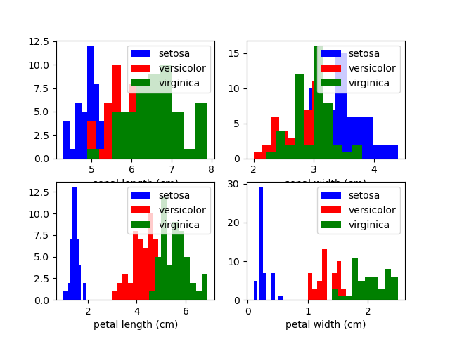
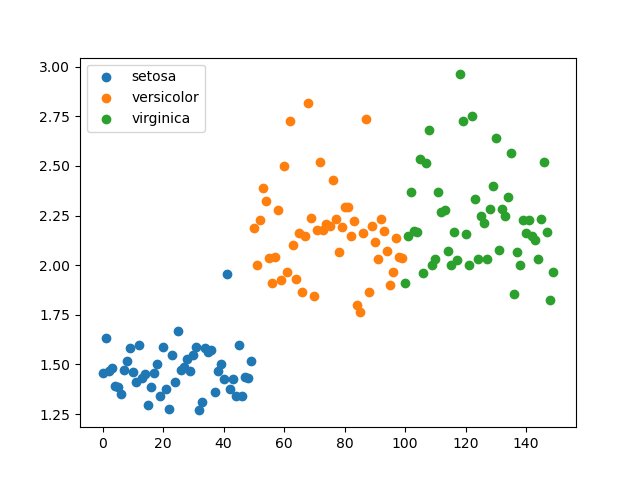
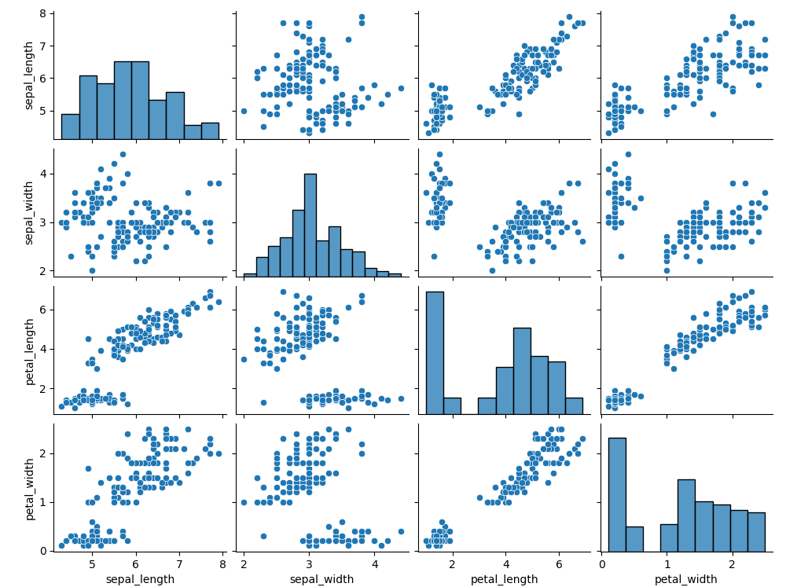
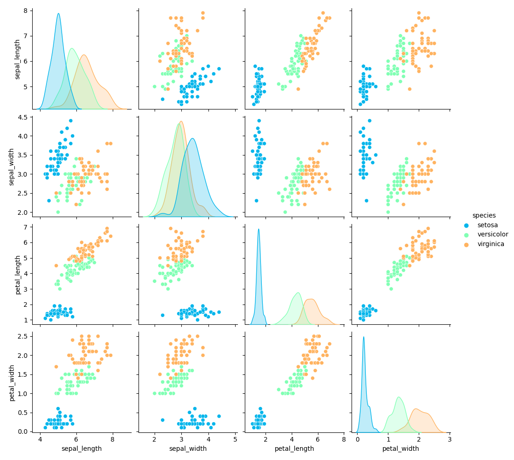

# pands-project

# Project for Programming and Scripting course
Analyse the Fisher's Iris data set

# Introduction : 
Fisher's Iris data set is a multivariate data set introduced by Ronald Fisher in 1936, as an example of linear discriminant analysis i.e. a method used in statistics to find a linear combination of features that characterizes or separates two or more classes of objects or events. In this study, Fisher wished to investigate if the species of an Iris flower could be identified by examining its petal and sepal length and width.

# Purpose of Task
Analyse the Iris Fisher Data Set
Write a program called analysis.py that:
1. Outputs a summary of each variable to a single text file,
2. Saves a histogram of each variable to png files, and
3. Outputs a scatter plot of each pair of variables.
4. Performs any other analysis you think is appropriate

# Installation
Run the python program analysis.py in Visual Studio Code

# PROGRAMMING AND SCRIPTING PROJECT : OUTPUT TEXT FILE
## 5 COLUMNS
There are 5 columns in the original iris.csv file: 'sepal_length', 'sepal_width', 'petal_length', 'petal_width', 'species'

## 9 COLUMNS
I added 4 more columns : 'sl*sw', 'pl/pw', 'sl+sw', 'pl-pw'
'sepal_length', 'sepal_width', 'petal_length', 'petal_width', 'species', 'sl*sw', 'pl/pw', 'sl+sw', 'pl-pw'
https://pandas.pydata.org/pandas-docs/stable/reference/api/pandas.DataFrame.columns.html

## PETAL LENGTH DIVIDED BY PETAL WIDTH
I printed the first 5 rowns in the column
https://pandas.pydata.org/pandas-docs/stable/reference/api/pandas.DataFrame.head.html

## "Data Shape : Numbers of rows and columns
There are 150 columns and 9 rows.
https://pandas.pydata.org/pandas-docs/stable/reference/api/pandas.DataFrame.shape.html

## ROWS 65 to 70
I only printed rows 65 to 70.
All other rows were ignored.
https://realpython.com/python-print/

## ROWS 100 to 105
Print ROWS 100 to 105
All other rows were ignored.

## SUMMARY OF DATA
The following statistical data is calculated: count, mean, std, min, 25%, 50%, 75% and max
Count : Number of rows
Mean: Average
Std: Standard Deviation
25% : Twenty Five percent
50% : Fifty percent
75% : Seventy five percent
Min: Minimum
Max : Maximum 

## Summary Statistical Analysis - Iris Setosa
The following statistical data is calculated: count, mean, std, min, 25%, 50%, 75% and max
For the species Iris Setosa. Not the other 2 species.

## Summary Statistical Analysis - Iris Versicolor
The following statistical data is calculated: count, mean, std, min, 25%, 50%, 75% and max
For the species Iris Versicolor. Not the other 2 species.

## Summary Statistical Analysis - Iris Virginica
The following statistical data is calculated: count, mean, std, min, 25%, 50%, 75% and max
For the species Iris Virginica. Not the other 2 species.

## THE FIRST 10 ROWS
I printed the head of the dataset to the ouput file.
All other rows were ignored.

## THE LAST 10 ROWS :
I printed the tail of the dataset to the ouput file.
All other rows were ignored.

## RANDOM SAMPLE OF 10 ROWS
I printed a random sample of 10 rows.
I called the pandas function sample()

## THE MEAN OF EACH SPECIES
I grouped the dataset by species and calculated the mean of each group.

## THE STANDARD DEVIATION OF EACH SPECIES
I grouped the dataset by species and calculated the standard deviation of each group.

## THE MEDIAN OF EACH SPECIES
I grouped the dataset by species and calculated the median of each group.

## THE MAX OF EACH SPECIES
I grouped the dataset by species and calculated the max of each group.

## THE SUM OF EACH SPECIES
I grouped the dataset by species and calculated the sum of each group.

## THE SUM TOTAL OF SEPAL LENGTH COLUMN
I calculated the sum of the sepal length column

## THE SUM TOTAL OF SEPAL WIDTH COLUMN
I calculated the sum of the sepal width column

## THE SUM TOTAL OF PETAL LENGTH COLUMN
I calculated the sum of the petal length column

## THE SUM TOTAL OF PETAL WIDTH COLUMN
I calculated the sum of the petal width column

## ROWS 140 - 150
I called the panndas iloc function to select rows 140 - 150

## REPLACE SETOSA WITH ROSE IN THE SPECIES COLUMN
I replaced setosa with rose in the species column.
Then I swiftly changed back to setosa.
The pandas replace function came in handy here.

## THE DATAFRAME SIZE :
The dataframe size is 1350
The pandas dataframe function did this for me.

## COLUMN 1 & 2
I printed columns 1 and 2. The other columns weren't printed.

# Histograms
Saves a histogram of each variable to png files

# Scatterplot
Saves a scatterplot of each variable to png files

# Histograms and Scatterplots
Saves histograms and scatterplots to a png file

# Pairplots
Saves pairplots to a png file

# Research
- https://www.geeksforgeeks.org/python-basics-of-pandas-using-iris-dataset/
- https://github.com/gabrielmulligan/fishersirisdataset/blob/master/fisher_scatterplot.py
- https://stackoverflow.com/questions/7439145/i-want-to-read-in-a-file-from-the-command-line-in-python
- https://www.geeksforgeeks.org/python-basics-of-pandas-using-iris-dataset/
- https://www.geeksforgeeks.org/python-pandas-dataframe-columns/
- https://realpython.com/python-print/
- https://stackoverflow.com/questions/43772362/how-to-print-a-specific-row-of-a-pandas-dataframe
- https://pandas.pydata.org/pandas-docs/stable/reference/api/pandas.DataFrame.head.html
- https://pandas.pydata.org/docs/getting_started/intro_tutorials/06_calculate_statistics.html
- https://pandas.pydata.org/docs/reference/api/pandas.DataFrame.tail.html#pandas.DataFrame.tail
- https://pandas.pydata.org/docs/reference/api/pandas.core.groupby.DataFrameGroupBy.sum.html?highlight=sum#pandas.core.groupby.DataFrameGroupBy.sum
- https://www.geeksforgeeks.org/python-pandas-dataframe-sample/
- https://www.w3schools.com/python/pandas/ref_df_iloc.asp
- https://pandas.pydata.org/pandas-docs/stable/reference/api/pandas.DataFrame.replace.html?highlight=replace#pandas.DataFrame.replace
- https://pandas.pydata.org/docs/reference/api/pandas.DataFrame.size.html?highlight=size#pandas.DataFrame.size

